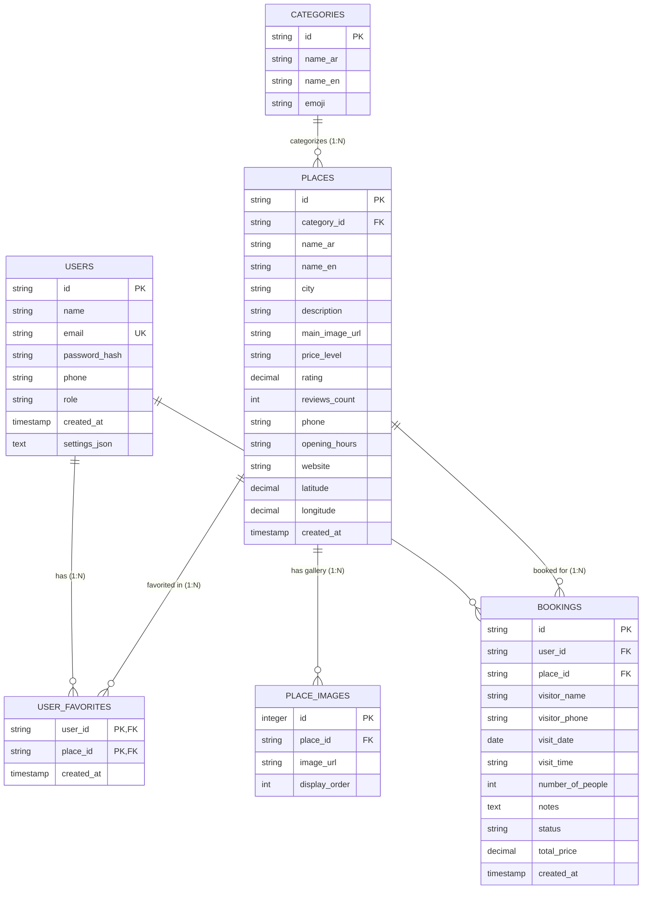

# 🗄️ Relational Database Architecture & ER Schema
### Project: دليلي السياحي — Tourist Guide App (Graduation Project Reference)

This document details the **Relational Database Design**, **Entity-Relationship (ER) Schema**, **Data Dictionary**, and **Graduation Defense Q&A Points** for the university examination committee.

---

## 1. ⚡ Clean Architecture Decoupling (Impact Analysis)

Because the project follows **Clean Architecture** with the **Repository Pattern**:

| Architecture Layer | Impact | Architectural Rationale |
|-------------------|--------|-------------------------|
| **UI & Screens** (`lib/screens/...`) | **0% Change** | UI screens only interact with `Providers` and `Repositories`, unaware of SQL mechanics. |
| **Domain Entities** (`lib/models/...`) | **0% Change** | `Place`, `Booking`, `Category`, `UserModel` remain pure Dart classes. |
| **Repository Layer** (`lib/data/repositories/...`) | **Implementation Connected** | Repositories invoke `SQLiteService` queries (`db.query()`, `db.insert()`, `db.delete()`). |
| **Storage Layer** (`lib/core/storage/...`) | **SQLite Core Added** | `SQLiteService` handles connection lifecycle, DDL, table migrations, and relational integrity. |

---

## 2. 🏛 Entity-Relationship (ER) Diagram



---

## 3. 📋 Data Dictionary (6 Relational Tables)

### 1. `categories` Table
Stores tourist categories (Restaurants, Mountains, Historical, etc.).
- **DDL**:
  ```sql
  CREATE TABLE categories (
    id TEXT PRIMARY KEY,
    name_ar TEXT NOT NULL,
    name_en TEXT NOT NULL,
    emoji TEXT
  );
  ```

### 2. `places` Table
Stores Syrian tourist destinations and restaurants.
- **DDL**:
  ```sql
  CREATE TABLE places (
    id TEXT PRIMARY KEY,
    category_id TEXT NOT NULL,
    name_ar TEXT NOT NULL,
    name_en TEXT,
    city TEXT NOT NULL,
    description TEXT,
    main_image_url TEXT NOT NULL,
    price_level TEXT DEFAULT 'متوسط',
    rating REAL DEFAULT 4.5,
    reviews_count INTEGER DEFAULT 1,
    phone TEXT,
    opening_hours TEXT,
    website TEXT,
    latitude REAL NOT NULL,
    longitude REAL NOT NULL,
    created_at TEXT DEFAULT CURRENT_TIMESTAMP,
    FOREIGN KEY (category_id) REFERENCES categories (id) ON DELETE RESTRICT
  );
  ```

### 3. `place_images` Table (1:N Gallery Relation)
Normalized gallery photos with cascade deletion.
- **DDL**:
  ```sql
  CREATE TABLE place_images (
    id INTEGER PRIMARY KEY AUTOINCREMENT,
    place_id TEXT NOT NULL,
    image_url TEXT NOT NULL,
    display_order INTEGER DEFAULT 0,
    FOREIGN KEY (place_id) REFERENCES places (id) ON DELETE CASCADE
  );
  ```

### 4. `users` Table
Stores registered tourist and administrator accounts.
- **DDL**:
  ```sql
  CREATE TABLE users (
    id TEXT PRIMARY KEY,
    name TEXT NOT NULL,
    email TEXT UNIQUE NOT NULL,
    password_hash TEXT NOT NULL,
    phone TEXT,
    role TEXT DEFAULT 'user',
    created_at TEXT DEFAULT CURRENT_TIMESTAMP,
    settings_json TEXT
  );
  ```

### 5. `user_favorites` Table (N:M Junction Table)
Resolves Many-to-Many relation between users and destinations.
- **DDL**:
  ```sql
  CREATE TABLE user_favorites (
    user_id TEXT NOT NULL,
    place_id TEXT NOT NULL,
    created_at TEXT DEFAULT CURRENT_TIMESTAMP,
    PRIMARY KEY (user_id, place_id),
    FOREIGN KEY (user_id) REFERENCES users (id) ON DELETE CASCADE,
    FOREIGN KEY (place_id) REFERENCES places (id) ON DELETE CASCADE
  );
  ```

### 6. `bookings` Table (1:N Customer Reservations)
Stores customer reservation records.
- **DDL**:
  ```sql
  CREATE TABLE bookings (
    id TEXT PRIMARY KEY,
    user_id TEXT,
    place_id TEXT,
    visitor_name TEXT NOT NULL,
    visitor_phone TEXT NOT NULL,
    visit_date TEXT NOT NULL,
    visit_time TEXT NOT NULL,
    number_of_people INTEGER DEFAULT 1,
    notes TEXT,
    status TEXT DEFAULT 'pending',
    total_price REAL DEFAULT 0.0,
    created_at TEXT DEFAULT CURRENT_TIMESTAMP,
    FOREIGN KEY (user_id) REFERENCES users (id) ON DELETE SET NULL,
    FOREIGN KEY (place_id) REFERENCES places (id) ON DELETE RESTRICT
  );
  ```

---

## 4. 🔗 Foreign Keys & Cardinality Summary

1. **`categories` ➔ `places` (`1 : N`)**: A category groups multiple places; each place references a valid category (`places.category_id REFERENCES categories.id`).
2. **`places` ➔ `place_images` (`1 : N`)**: A place has multiple gallery images. `ON DELETE CASCADE` ensures deleting a place removes its photos.
3. **`users` ➔ `places` via `user_favorites` (`N : M`)**: A user can favorite many places, and a place can be favorited by many users. Composite PK `(user_id, place_id)` enforces uniqueness.
4. **`users` ➔ `bookings` (`1 : N`)**: A user can submit multiple bookings. `ON DELETE SET NULL` preserves booking logs if an account is removed.
5. **`places` ➔ `bookings` (`1 : N`)**: A place receives bookings. `ON DELETE RESTRICT` prevents accidental place removal while active bookings exist.

---

## 🎓 5. Graduation Defense Q&A Points

> **Q1: How does your application ensure Relational Integrity and prevent orphaned rows?**
> **Answer:** We execute `PRAGMA foreign_keys = ON;` in SQLite. We employ `ON DELETE CASCADE` for place galleries and user favorites, and composite primary keys `(user_id, place_id)` to avoid duplicate favorites.

> **Q2: Why is the gallery stored in a separate table instead of a comma-separated column?**
> **Answer:** To adhere to First Normal Form (1NF) requiring atomic column values. Storing images in `place_images` allows dynamic ordering, individual updates, and unlimited photos per attraction.
